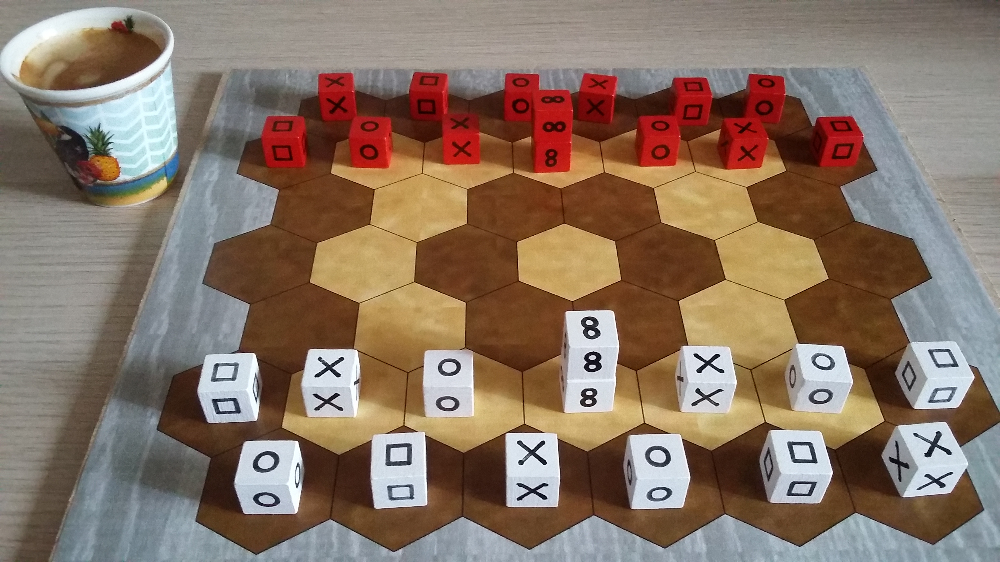

# Pijersi : the rules (en) + les règles (fr)




2 pages in English + 2 pages en Français

<div style="page-break-after: always;"></div>

# Pijersi: the rules of the game

In the game "pijersi", two players, white and black, move their cubes, alone or in dynamic stacks, which compete in their roles of "rock", "paper", "scissors" and "wise man". Each player attempts to reach first the last opposing line. 

The game "[pijersi](https://github.com/LucasBorboleta/pijersi)" is a variant of the game "[jersi](https://github.com/LucasBorboleta/jersi)". In [Lojban](https://mw.lojban.org/), the root "prije" and its affix "pi" mean "wise", while the root "jersi" means "to chase" or "to pursue". Pronounce `/pee/jer/see/`.

## General information

Number of players: 2 / Minimum age: 8 years / Game duration: 15 minutes 

## Components

You (either white or black player) has 14 cubes in your color. The 6 same faces of a cube define its role (example: rock). You have:

- 4 "rock", 4 "paper" and 4 "scissors" (represented by either the letters "R/P/S" or the symbols "circle/square/cross").
- 2 "wise man", just called "wise" (represented by either the letter "W" or the symbol "infinity").

The following hexagonal board, of 45 spaces and 7 lines, is arranged between the 2 players:

```
   1 2 3 4 5 6      [line “g”]
  1 2 3 4 5 6 7     [line “f”]
   1 2 3 4 5 6      [line “e”]
  1 2 3 4 5 6 7     [line “d”]
   1 2 3 4 5 6      [line “c”]
  1 2 3 4 5 6 7     [line “b”]
   1 2 3 4 5 6      [line “a”]
```

## Set up

On the 2 lines closest to you ("ab" for white and "fg" for black), you put your cubes as shown below. Your "wise" cubes are stacked. The white player starts the game. 

Here the uppercase letters identify the cubes of white and the lowercase those of black.

```
      s.  p.  r.  s.  p.  r.
    p.  r.  s.  ww  r.  s.  p.
      ..  ..  ..  ..  ..  ..
    ..  ..  ..  ..  ..  ..  ..
      ..  ..  ..  ..  ..  ..
    P.  S.  R.  WW  S.  R.  P.
      R.  P.  S.  R.  P.  S.
```

## Goal of the game

To win, you must bring first at least one of your "sky" cubes to the last opposing line (white targets the "g" line and black targets the "a" line) or else must prevent your opponent from playing in turn. The game is a tie after 20 turns without any capture since the beginning or the last capture.

## Stacking rules

Cube movements (which are explained below) make it possible to build stacks that must comply with the following rules.

A stack is limited to any 2 cubes of the same color, except that a “wise” cube only stacks on top of a “wise” cube.

## Moving rules

A cube, alone or at the top of a stack, moves from a single space, either to an empty space or to an occupied space to stack on top of another cube (respecting the stacking rules) or to capture an opposing cube or stack (respecting the capturing rules that are explained below).

A stack moves, without forking or jumping over occupied spaces, from 1 or 2 spaces, either to an empty space or to an occupied space to capture an opposing cube or stack (respecting the capturing rules).

The stack built during your turn can be moved, and conversely, the stack moved during your turn can be unbuilt by moving its top. This sequence of 2 actions is possible only once during your turn.

## Capturing rules

Knowing that a "unit" refers to a cube or a stack, only the "rock/paper/scissors" units capture each other, and regardless of their heights (example: a cube can capture a stack). "Wise" units never capture and are never captured.

The role "rock/paper/scissors/wise" of a stack is determined by the cube at its top. The top of a stack is never captured alone: the entire stack is captured.

A unit captures an opposing unit by moving if it respects the following order of roles: "rock" captures "scissors"; "scissors" captures "paper"; "paper" captures "rock". A "wise" cube can be captured if it is at the bottom of a "rock/paper/scissors" stack.

Any captured unit is permanently removed from the board.

## Copyright

[](http://creativecommons.org/licenses/by-nc-sa/4.0/) Copyright (C) 2022 Lucas Borboleta.

Pijersi, rules of a strategy game for two players, by Lucas Borboleta (https://github.com/LucasBorboleta/pijersi) is licensed under a Creative Commons Attribution-NonCommercial-ShareAlike 4.0 International License. To view a copy of this license, visit http://creativecommons.org/licenses/by-nc-sa/4.0/.

Permissions beyond the scope of this license may be available at [lucas.borboleta@free.fr](mailto:lucas.borboleta@free.fr).

<div style="page-break-after: always;"></div>

# Pijersi : les règles du jeu

Dans le jeu “pijersi”, deux joueurs, blanc et noir, déplacent leurs cubes, seuls ou en piles dynamiques, qui s’affrontent dans leurs rôles de "pierre", "feuille", "ciseaux" et "sage". Chaque joueur s’efforce d’atteindre le premier la dernière ligne adverse. 

Le jeu "[pijersi](https://github.com/LucasBorboleta/pijersi)” est une variante du jeu “[jersi](https://github.com/LucasBorboleta/jersi)”. En [lojban](https://mw.lojban.org), la racine “prije” et son affixe “pi” signifient “sage”, tandis que la racine “jersi” signifie “chasser” ou “poursuivre”. Prononcer `/pi/jer/ssi/`.

## Informations générales
Nombre de joueurs : 2 / Age minimum : 8 ans / Durée de partie : 15 minutes 

## Matériel
Vous (joueur blanc ou noir) avez 14 cubes à votre couleur. Les 6 mêmes faces d'un cube définissent son rôle (exemple : pierre). Vos avez :

- 4 "pierre", 4 "feuille" et 4 "ciseaux" (représentés soit par les lettres "R/P/S" ou les symboles "cercle/carré/croix").
- 2 "sage" (représenté soit par la lettre "W" ou le symbol "infini").

Le plateau hexagonal suivant, de 45 cases et de 7 lignes, est disposé entre les 2 joueurs :

```
   1 2 3 4 5 6      [ligne “g”]
  1 2 3 4 5 6 7     [ligne “f”]
   1 2 3 4 5 6      [ligne “e”]
  1 2 3 4 5 6 7     [ligne “d”]
   1 2 3 4 5 6      [ligne “c”]
  1 2 3 4 5 6 7     [ligne “b”]
   1 2 3 4 5 6      [ligne “a”]
```

## Mise en place
Sur les 2 lignes les plus proches de vous (“ab” pour blanc et “fg” pour noir), vous placez vos cubes comme indiqué ci-dessous. Vos cubes "sage" sont empilés. Le joueur blanc entame la partie. 

Ici les lettres majuscules repèrent les cubes de blanc et les minuscules ceux de noirs.

```
      s.  p.  r.  s.  p.  r.
    p.  r.  s.  ww  r.  s.  p.
      ..  ..  ..  ..  ..  ..
    ..  ..  ..  ..  ..  ..  ..
      ..  ..  ..  ..  ..  ..
    P.  S.  R.  WW  S.  R.  P.
      R.  P.  S.  R.  P.  S.
```

## But du jeu

Pour gagner, vous devez amener le premier au moins un de vos cubes “ciel” sur la dernière ligne adverse (blanc vise la ligne “g” et noir vise la ligne “a”) ou bien vous devez empêcher votre adversaire de jouer à son tour. La partie est nulle après 20 tours sans aucune capture, depuis l'entame ou la dernière capture.

## Règles de pile
Les déplacements de cubes (qui sont expliqués après) permettent de construire des piles qui doivent respecter les règles qui suivent.

Une pile est limitée à 2 cubes quelconques de même couleur, sauf qu'un cube “sage” s’empile seulement sur un cube “sage”. 

## Règles de déplacement
Un cube, seul ou au sommet d’une pile, se déplace d’une seule case, soit vers une case vide, soit vers une case occupée pour s’empiler sur un autre cube (en respectant les règles de pile) ou pour capturer un cube ou une pile adverse (en respectant les règles de capture qui sont expliquées après).

Une pile se déplace, sans bifurquer, ni sauter par-dessus des cases occupées, de 1 ou 2 cases, soit vers une case vide, soit vers une case occupée pour capturer un cube ou une pile adverse (en respectant les règles de capture).

La pile construite pendant votre tour peut être déplacée, et réciproquement, la pile déplacée pendant votre tour peut être déconstruite en déplaçant son sommet. Cet enchaînement de 2 actions est possible une seule fois pendant votre tour.

## Règles de capture
Sachant qu'une "unité" désigne un cube ou une pile, seules les unités “pierre/feuille/ciseaux” se capturent entre elles, et indépendamment de leurs hauteurs (exemple : un cube peut capturer une pile). Les unités "sage" ne capturent jamais et ne sont jamais capturées.

Le rôle “pierre/feuille/ciseaux/sage" d’une pile est déterminé par le cube à son sommet. Le sommet d'une pile n'est jamais capturé seul : c'est toute la pile qui est capturée. Un cube "sage" peut être capturé s'il est en bas d'une pile "pierre/feuille/ciseaux".

Une unité capture une unité adverse par déplacement à condition de respecter l’ordre suivant des rôles : "pierre" capture "ciseaux" ; "ciseaux" capture "feuille" ; "feuille" capture "pierre".

Toute unité capturée est retirée définitivement du plateau.

## Copyright

[](http://creativecommons.org/licenses/by-nc-sa/4.0/) Copyright (C) 2022 Lucas Borboleta.

Pijersi, règles d'un jeu pour deux joueurs, de Lucas Borboleta (https://github.com/LucasBorboleta/pijersi) est mis à disposition selon les termes de la licence Creative Commons Attribution - Pas d’Utilisation Commerciale - Partage dans les Mêmes Conditions 4.0 International. Pour afficher une copie de cette licence, visitez http://creativecommons.org/licenses/by-nc-sa/4.0/.

Les autorisations au-delà du champ de cette licence peuvent être obtenues à [lucas.borboleta@free.fr](mailto:lucas.borboleta@free.fr).
