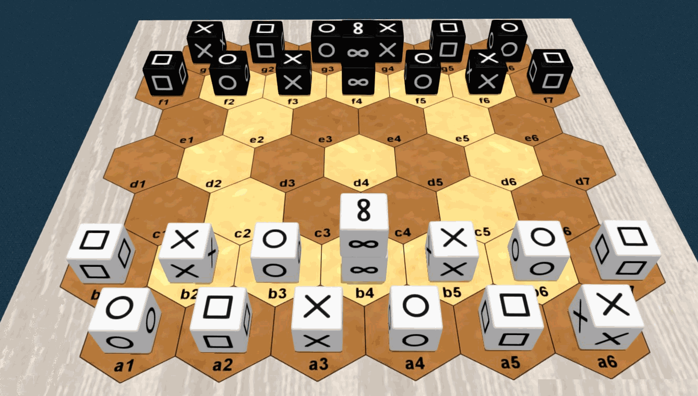
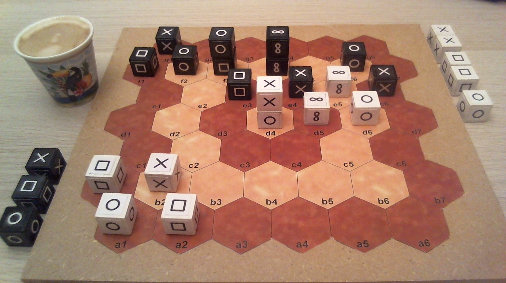

# Pijersi : learning, playing and making

In the "pijersi" game, two players, White and Black, move their cubes, alone or in dynamic stacks, which either capture each other according to the major roles of "**rock**", "**paper**" and "**scissors**", or are blocked by the minor role of "**wise**". The goal is to reach the **opponent back row**, with at least one major cube.

Number of players: 2 / Minimum age: 8 years / Game duration: 15 to 30 minutes

Game kind: cross win condition, stacking and capturing; abstract game

Author: Lucas Borboleta, © 2022, CC-BY-NC-SA

Credit for 3D pictures: [Tabetopia](https://tabletopia.com/games/pijersi)

## Learning Pijersi

  You can learn the rules :

- by reading the [rulebook](./pijersi-the-rules.md) (ou les [règles du jeu](./pijersi-les-regles.md) en français);
- by watching the [video-rules](https://youtu.be/w2c6-h2DAus) (ou les [vidéo-règles](https://youtu.be/w41zrhBB5t8) en français) ;
- by watching the [recorded matches](https://www.youtube.com/playlist?list=PLui_B_YF7szPmwLvfPH-0QQpYrAeC9LoT) on the [LucasBorboleta](https://www.youtube.com/@lucasborboleta) YouTube channel;
- by studying a few registered [games](./games) as animated pictures and text notations.
- by playing against the Windows application [pijersi-certu](https://github.com/LucasBorboleta/pijersi-certu) that shows the possible moves.

## Playing Pijersi

You can play for free:

- on Windows desktop, against the artificial intelligence agents (AI) of the application [pijersi-certu](https://github.com/LucasBorboleta/pijersi-certu) ;
- on the Web platform [Tabetopia](https://tabletopia.com), against on-line players, at [Pijersi](https://tabletopia.com/games/pijersi).

## Making Pijersi 

You can craft your own physical game of Pijersi under the copyright conditions mentioned below. 

A few crafting options are given in the [DIY](./DIY.md) document.

For this purpose, some drawings are available to you in the [pictures](./pictures) folder in the following formats: [PNG](./pictures/png-kit), [SVG](./pictures/svg-kit) and [WMF](./pictures/wmf-kit). Also, the original [GeoGebra](./pictures/ggb-kit) files are provided. 

## Sister projects

- By [Lucas Borboleta](https://github.com/LucasBorboleta): a Python Alpha-Beta AI agent, which is interfaced with a 2D GUI. The project is available as a single  [Windows executable](https://github.com/LucasBorboleta/pijersi-certu/blob/main/docs/INSTALL.md).
- By [Arthur Liu](https://github.com/arthur-liu-lsh): a powerful C++ [Alpha-Beta AI agent](https://github.com/arthur-liu-lsh/pijersi-engine), which is interfaced with a 3D desktop [Unity GUI](https://github.com/arthur-liu-lsh/pijersi-unity).

## Copyright

 Copyright (C) 2022 Lucas Borboleta.

Pijersi, rules of a strategy game for two players, by Lucas Borboleta (https://github.com/LucasBorboleta/pijersi) is licensed under a Creative Commons Attribution-NonCommercial-ShareAlike 4.0 International License. To view a copy of this license, visit http://creativecommons.org/licenses/by-nc-sa/4.0/.

Permissions beyond the scope of this license may be available at [lucas.borboleta@free.fr](mailto:lucas.borboleta@free.fr).
