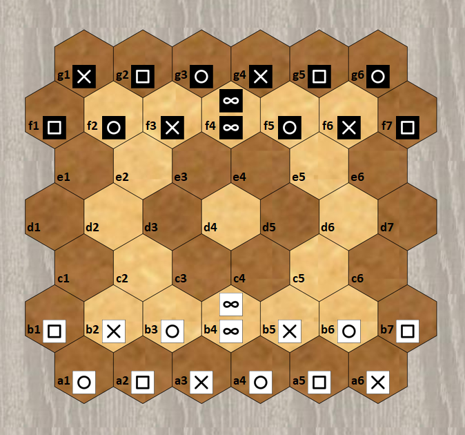

# Pijersi : rules of the game

## Introduction

In the game "pijersi", two players, white and black, move their cubes, alone or in dynamic stacks, which compete in their roles of "rock", "paper", "scissors" and "wise man". Each player attempts to reach first the last opposing line. 

## Components

You (white/black player) have 14 cubes in your color. The 6 same faces of a cube define its role (example: rock). You have:

- 4 "rock", 4 "paper" and 4 "scissors" (respectively the symbols "circle/square/cross").
- 2 "wise man", just called "wise" (the symbol "infinity").

The following hexagonal board, of 45 spaces and 7 lines, is arranged between the 2 players:

## Set up

On the 2 lines closest to you ("ab" for white and "fg" for black), you put your cubes as shown above. Your "wise" cubes are stacked. You fill in your back line from left to right, with two rock-paper-scissors sequences. Then, you complete your two lines by building rock-paper-scissors triangles.

The white player starts the game. 

## Goal of the game

You must bring first a “rock/paper/scissors” cube (alone or in a stack) to the last opposing line (white targets the "g" line and black targets the "a" line) or else must prevent your opponent from playing in turn. The game is a tie after 20 turns without any capture since the beginning or the last capture.

## Stacking rules : building and unbuilding

A stack is built by moving a cube (respecting the moving rules) to stack it on another cube respecting the following rule: a stack is limited to any 2 cubes of the same color, except that a “wise” cube only stacks on a “wise” cube.

A stack is unbuilt by moving the cube on its top (respecting the movement and capture rules).

## Moving rules

A cube, alone or at the top of a stack, moves from a single space, either to an empty space or to an occupied space to stack on top of one of your cube (respecting the stacking rules) or to capture an opposing cube or stack (respecting the capturing rules that are explained below). A cube at the bottom of the stack is not movable.

A stack moves straight 1 or 2 spaces, without forking or jumping over occupied spaces, either to an empty space or to an occupied space to capture an opposing cube or stack (respecting the capturing rules).

The stack built during your turn can be immediately moved, and conversely, the stack moved during your turn can be immediately unbuilt by moving its top. This sequence of 2 actions is possible only once during your turn.

## Capturing rules

The cubes and the stacks capture each other, and independently of their heights (example: a cube can capture a stack). The top of a stack is never captured alone: the entire stack is captured. Any cube or stack captured is permanently removed from the board.

The "rock/paper/scissors/wise" roles determine captures. The "rock/paper/scissors/wise" role of a stack is determined by the cube at its top.

A cube or stack in "wise" role never captures and is never captured. A "wise" cube can be captured if it is at the bottom of a "rock/paper/scissors" stack.

A cube or a stack captures an opponent's cube or stack by movement, provided that the following order of roles is respected: "rock" captures "scissors"; "scissors" captures "paper"; "paper" captures "rock".

The rules for moving a stack and its top allow two captures during a turn.

 Copyright (C) 2022  [lucas.borboleta@free.fr](mailto:lucas.borboleta@free.fr) ; license Creative Commons BY-NC-SA
