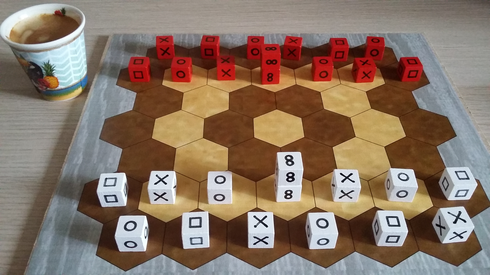

# Pijersi : les règles du jeu

Type de jeu : traverser pour gagner + empilement + capture

## Introduction

Dans le jeu “pijersi”, deux joueurs, blanc et noir, déplacent leurs cubes, seuls ou en piles dynamiques, qui s’affrontent dans leurs rôles de "pierre", "feuille", "ciseaux" et "sage". Chaque joueur s’efforce d’atteindre le premier la dernière ligne adverse. 

Le jeu "[pijersi](https://github.com/LucasBorboleta/pijersi)” est une variante du jeu “[jersi](https://github.com/LucasBorboleta/jersi)”. En [lojban](https://mw.lojban.org), la racine “prije” et son affixe “pi” signifient “sage”, tandis que la racine “jersi” signifie “chasser” ou “poursuivre”. Prononcer `/pi/jer/ssi/`.

## Informations générales
Nombre de joueurs : 2 / Age minimum : 8 ans / Durée de partie : 15 minutes 

## Matériel
Vous (joueur blanc/noir) avez 14 cubes à votre couleur (sur la photo: rouge remplace noir). Les 6 mêmes faces d'un cube définissent son rôle (exemple : pierre). Vous avez :

- 4 "pierre", 4 "feuille" et 4 "ciseaux" (respectivement, les symboles "cercle/carré/croix").
- 2 "sage" (le symbole "infini").

Le plateau hexagonal suivant, de 45 cases et de 7 lignes, est disposé entre les 2 joueurs :

## Mise en place
Sur les 2 lignes les plus proches de vous (“ab” pour blanc et “fg” pour noir), vous placez vos cubes comme indiqué ci-dessus. Vos cubes "sage" sont empilés. Vous remplissez votre ligne arrière de gauche à droite, avec deux séquences pierre-feuille-ciseaux. Puis, vous complétez vos deux lignes en construisant des triangles pierre-feuille-ciseaux.

Le joueur blanc entame la partie. 

## But du jeu

Vous devez amener le premier un cube “pierre/feuille/ciseaux” (seul ou en pile) sur la dernière ligne adverse (blanc vise la ligne “g” et noir vise la ligne “a”) ou bien vous devez empêcher votre adversaire de jouer à son tour. La partie est nulle après 20 tours sans aucune capture, depuis l'entame ou la dernière capture.

## Règles de pile : construction et déconstruction

Une pile est construite en déplaçant un cube (en respectant les règles de déplacement) pour l'empiler sur un autre cube en respectant la règle suivante : une pile est limitée à 2 cubes quelconques de même couleur, excepté qu'un cube “sage” s’empile seulement sur un cube “sage”.

Une pile est déconstruite en déplaçant le cube à son sommet (en respectant les règles de déplacement et de capture).

## Règles de déplacement

Un cube, seul ou au sommet d’une pile, se déplace d’une seule case, soit vers une case vide, soit vers une case occupée pour s’empiler sur un de vos cubes (en respectant les règles de pile) ou pour capturer un cube ou une pile adverse (en respectant les règles de capture). Un cube en bas de pile n'est pas déplaçable.

Une pile se déplace de 1 ou 2 cases, sans bifurquer, ni sauter par-dessus des cases occupées, soit vers une case vide, soit vers une case occupée pour capturer un cube ou une pile adverse (en respectant les règles de capture).

La pile construite pendant votre tour peut être immédiatement déplacée, et réciproquement, la pile déplacée pendant votre tour peut être immédiatement déconstruite en déplaçant son sommet. Cet enchaînement de 2 actions est possible une seule fois pendant votre tour.

## Règles de capture

Les cubes et les piles se capturent entre eux, et indépendamment de leurs hauteurs (exemple : un cube peut capturer une pile). Le sommet d'une pile n'est jamais capturé seul : c'est toute la pile qui est capturée. Tout cube ou un pile capturé est définitivement retiré du plateau.

Les rôles “pierre/feuille/ciseaux/sage" détermine les captures. Le rôle “pierre/feuille/ciseaux/sage" d’une pile est déterminé par le cube à son sommet. 

Un cube ou une pile de rôle "sage" ne capture jamais et n'est jamais capturé. Un cube "sage" peut être capturé s'il est en bas d'une pile de rôle "pierre/feuille/ciseaux".

Un cube ou une pile capture un cube ou une pile adverse par déplacement à condition de respecter l’ordre suivant des rôles : "pierre" capture "ciseaux" ; "ciseaux" capture "feuille" ; "feuille" capture "pierre".

Les règles de déplacement d'une pile et de son sommet rendent possible deux captures par tour de jeu.

## Copyright

 Copyright (C) 2022 Lucas Borboleta. Pijersi, règles d'un jeu pour 2 joueurs, de Lucas Borboleta (https://github.com/LucasBorboleta/pijersi) est mis à disposition selon la licence Creative Commons Attribution - Pas d’Utilisation Commerciale - Partage dans les Mêmes Conditions 4.0 International ; visitez http://creativecommons.org/licenses/by-nc-sa/4.0/. 

Les autorisations au-delà du champ de cette licence peuvent être obtenues à [lucas.borboleta@free.fr](mailto:lucas.borboleta@free.fr).
