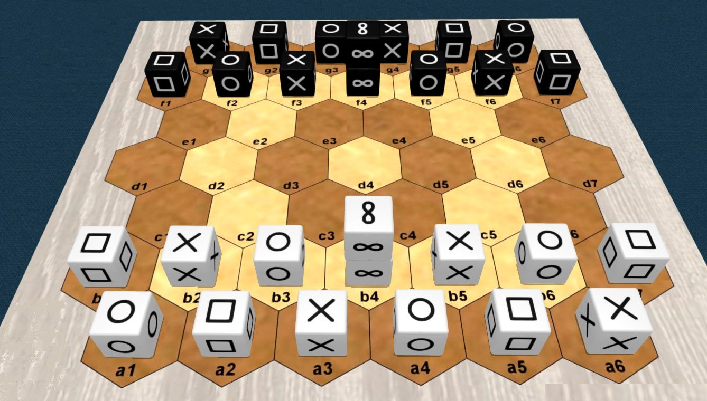
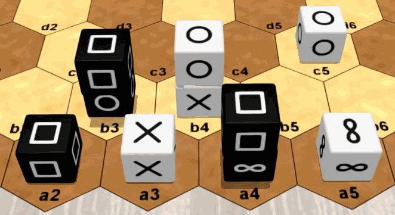
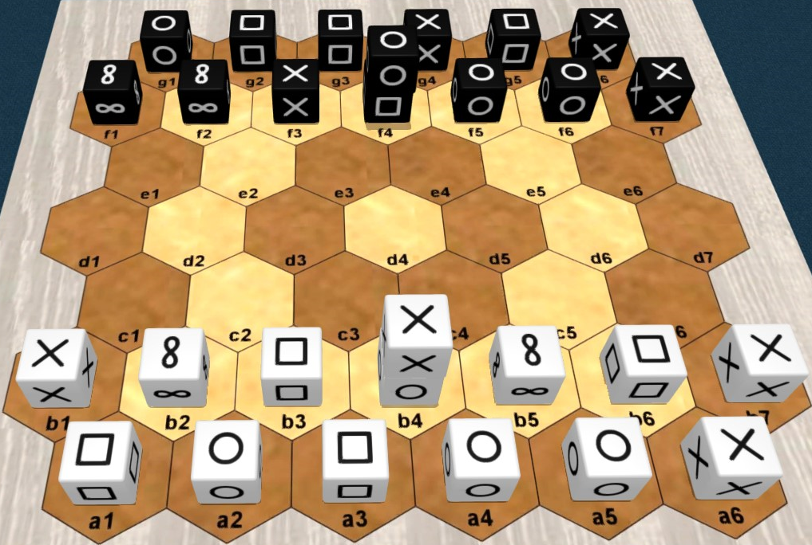
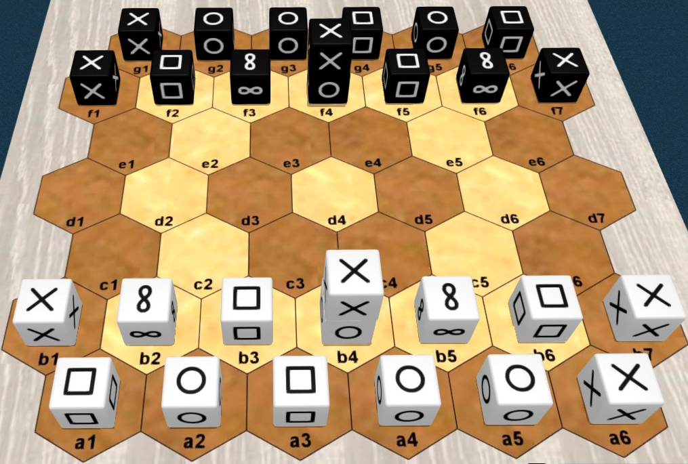

# Pijersi : les règles du jeu


## Informations générales

Nombre de joueurs : 2 / Age minimum : 8 ans / Durée de partie : 15 à 30 minutes 

Type de jeu : traverser pour gagner, empilement et capture ; jeu abstrait

Auteur : Lucas Borboleta, © 2022, CC-BY-NC-SA

Crédit pour les images 3D : [Tabetopia](https://tabletopia.com/games/pijersi)

## Introduction

Dans le jeu "pijersi", deux joueurs, Blanc et Noir, déplacent leurs cubes, seuls ou en piles dynamiques, qui soit s'entre-capturent selon les rôles majeurs de "**pierre**", "**feuille**" et "**ciseaux**", soit sont bloqués par le rôle mineur du "**sage**". Le but est d'atteindre la **ligne arrière adverse**, avec au moins un cube majeur.

## Matériel

Le jeu “pijersi” comprend un plateau de 45 hexagones, 14 cubes blancs et 14 cubes noirs. Voir l'image ci-dessous.

Les six faces de chaque cube sont identiques. Les faces possibles sont “pierre”  , “feuille” , “ciseaux”  et “sage” . Chaque joueur possède 4 pierres, 4 feuilles, 4 ciseaux et 2 sages.



## Mise en place

La mise en place *classique* des cubes est indiquée sur l'image ci-dessus. Les **cubes sages** sont **empilés** au **milieu** de chaque **rangée avant**. Les positions de **Noir** sont **symétriques** de celles de **Blanc** par rapport au **centre** du plateau ; exemple : les cubes ciseaux en a6 et g1.

Afin de varier l'expérience du jeu, les mises en place *aléatoire-totale* et *aléatoire-miroir* peuvent être utilisées ; ils sont expliqués plus loin.

## But du jeu


Vous devez amener le premier, sur la **rangée arrière adverse**, un cube ou une pile de rôle "pierre", "feuille" ou "ciseaux". Y amener un cube ou une pile de rôle "sage" est autorisé, mais de procure pas la victoire.

Empêcher votre adversaire de jouer vous procure également la victoire.

La partie est nulle après 20 tours (10 par joueur) sans capture, depuis le début ou la dernière capture.

Dans l'image ci-dessus, Blanc gagne en atteignant le but en g6 avec sa "pierre" .

## Vue d'ensemble

Blanc démarre la partie.

A **votre tour**, vous déplacez **un cube** ou **une pile** de votre couleur. La pile est plus puissance que le cube : elle va plus loin que le cube, et sous conditions, elle permet une **seconde action**.

Se déplacer dans un espace occupé par l'adversaire vous permet, sous conditions, de capturer son cube ou sa pile. Les pièces capturées sont définitivement retirées du plateau.

Vous construisez une pile en déplaçant un cube au-dessus d'un autre. Vous déconstruisez une pile en déplaçant le cube de son sommet. En déplaçant un seul cube, vous pouvez simultanément déconstruire une pile et en construire une autre.

## Rôles et captures

Les six faces d'un cube sont identiques et déterminent son rôle : pierre, feuille, ciseaux ou sage.

Les rôles définissent les possibilités de capture entre pièces (cubes ou piles) : le rôle "pierre" capture le rôle "ciseaux" ; le rôle "ciseaux" capture le rôle "papier" ; le rôle "papier" capture le rôle "pierre" ; le rôle "sage" ne capture rien et rien ne le capture.

**pierre**  `==>` **ciseaux**  `==>` **feuille**  `==>` **pierre**  

rien`==>` **sage**  `==>` rien

Les captures se font, sans sauter, lors des mouvements qui sont expliqués plus loin.

## Piles et captures

Une pile est restreinte à **deux cubes** de **même couleur**. Ses deux cubes ont n'importe quels rôles, à **une exception** : pas de "sage" au-dessus de "pierre", "feuille" ou "ciseaux", comme montré sur l'image suivante.


Le rôle d'une pile est uniquement déterminé par le rôle du cube à son sommet. L'image suivante montre 4 piles de rôle "feuille".


Les cubes et les piles se capturent les uns les autres, parce que seuls leurs rôles comptent. Lorsqu'une pile est attaquée, ses deux cubes sont capturés. Un cube "sage" en bas d'une pile de rôle "pierre", "feuille" ou "ciseaux" peut être indirectement capturé lors de l'attaque de sa pile.



Dans l'image ci-dessus : le cube "ciseaux" en a3 peut capturer le cube "feuille" en a2 ou la pile "feuille" en b3 ou encore la pile "feuille" en a4 ; la pile "feuille" en a4 peut capturer la pile "pierre" en b4 ou le cube "pierre" en c5 ; le cube "sage" en a5 ne peut rien capturer, et aucune pièce ne peut le capturer.

## Déplacer un cube

Un **cube**, seul ou au sommet d'une pile, **se déplace** **d'un seul espace**, soit vers un espace vide, soit vers un espace occupé pour s'empiler sur un de vos cubes (en respectant les règles des piles) ou pour capturer un cube ou une pile adverse (en respectant les règles de capture ). Un cube en bas de pile ne peut pas être déplacé individuellement.


Dans l'image ci-dessus : le cube "ciseaux" en a2 peut se déplacer en a3 ou au sommet de b3 ; la "feuille" en b4 peut se déplacer en b5 ou au sommet de b3.

## Déplacer une pile

Une **pile se déplace de 1 ou 2 espaces alignés**, sans bifurquer ni sauter par-dessus des espaces occupés, soit vers un espace vide, soit vers un espace occupé pour capturer un cube ou une pile adverse (en respectant les règles de capture).


Dans l'image ci-dessus : la pile "ciseaux" en b4 peut se déplacer soit en a3, soit en a4, soit en b5 ou soit en b6, mais pas en a5.

## Seconde action

La pile construite pendant votre tour peut immédiatement être déplacée, et réciproquement, la pile déplacée pendant votre tour peut immédiatement être déconstruite en déplaçant son sommet. Cette séquence de 2 actions est possible seulement une fois pendant votre tour.


Dans l'image ci-dessus : pendant son tour, Blanc peut empiler le cube "ciseaux" a2 sur a3, puis déplacer la pile a3 en a5 ; pendant son tour, Noir peut déplacer la pile "pierre" b3 en b5, puis déplacer le cube "pierre" cube b5 en a4.

## Mises en place aléatoires

Pour varier l'expérience du jeu les mises en place *aléatoire-totale* et *aléatoire-miroir* peuvent être utilisées.

Comme pour la mise en place *classique*, les positions de départ sont les deux premières rangées de chaque bord , avec deux cubes empilés au milieu chaque rangée avant. Cependant, pour une mise en place aléatoire, les cubes sont sélectionnés au hasard selon un ordre convenu, et si la pile générée n'est pas autorisée, alors ses deux cubes sont inversés.

Pour la mise en place *aléatoire-totale*, les côtés Blanc et Noir sont préparés indépendamment, comme dans l'image suivante.



Pour la mise en place *aléatoire-miroir*, le côté Blanc est préparé d'abord, puis le côté Noir est déduit par symétrie centrale, comme dans l'image suivante.



## Affichage 2D

Les paires d'images suivantes montrent des représentations 2D et 3D équivalentes que vous pourrez voir à propos de "pijersi". Dans n'importe quelle image 2D, **deux cubes** à l'intérieur du **même hexagone** doivent toujours s'interpréter comme une **pile**.

 `<==>`

`<==>`

## Notation

Un exemple de notation d'une partie est montré dans le texte suivant. Cette partie est aussi affichée dans l'image animée suivante.

```
   g16:sprspr f13:prs f4:ww f57:rsp
   b13:PSR b4:WW b57:SRP a16:RPSRPS

   1 a4-b5=c4             2 f4=d5-d4        
   3 a1-b2=c2             4 f1-f2=d3        
   5 c2=c3-c2             6 d3=c2!-b3!      
   7 a3-b3!               8 c2-b3!          
   9 a2-b3!              10 g6-f7=d6        
  11 a5-b6=c5            12 d6=e6-f6        
  13 c4-c3=d3            14 g4-f5=e4        
  15 d3=f2-g1!
```


Les lignes de prologue décrivent la mise en place, qui est supposée *classique* lorsque omise. Les cubes sont représentés par des lettres (« p » pour « paper » = « feuille », « r » pour « rock » = « pierre », « s » pour « scissors » = « ciseaux, « w » pour « wise » = « sage » d'après l'anglais) avec des minuscules pour Noir et des majuscules pour Blanc. Une pile est toujours représentée par une position isolée dans l'ordre sommet-base. Les cubes seuls sont représentés au choix par des positions isolées ou par des intervalles de positions adjacentes d'une même rangée.

Après le prologue, chaque tour est numéroté et décrit une ou deux actions. Les positions source et destination sont jointes par "-" si un cube se déplace et par "=" si une pile se déplace. Optionnellement, "!" commente une capture.

## Copyright


Copyright (C) 2022 Lucas Borboleta. Pijersi, règles d'un jeu pour 2 joueurs, de Lucas Borboleta (https://github.com/LucasBorboleta/pijersi) est mis à disposition selon la licence Creative Commons Attribution - Pas d’Utilisation Commerciale - Partage dans les Mêmes Conditions 4.0 International ; visitez http://creativecommons.org/licenses/by-nc-sa/4.0/. 

Les autorisations au-delà du champ de cette licence peuvent être obtenues à [lucas.borboleta@free.fr](mailto:lucas.borboleta@free.fr).

