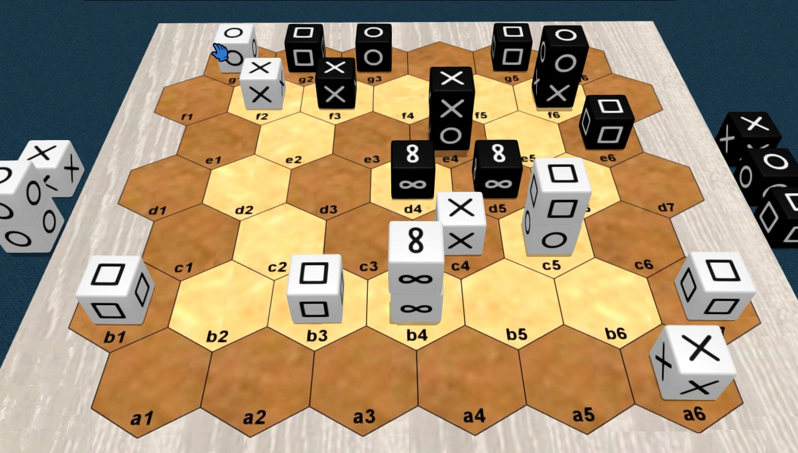
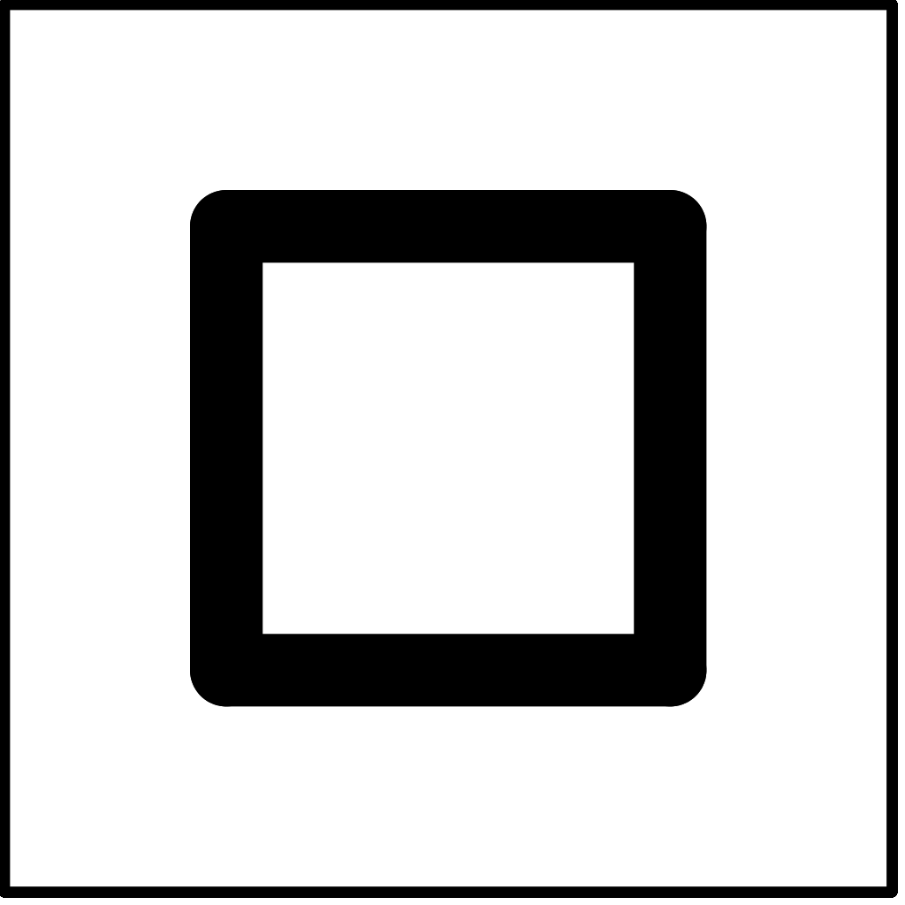
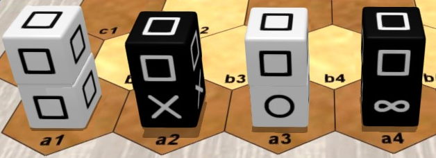
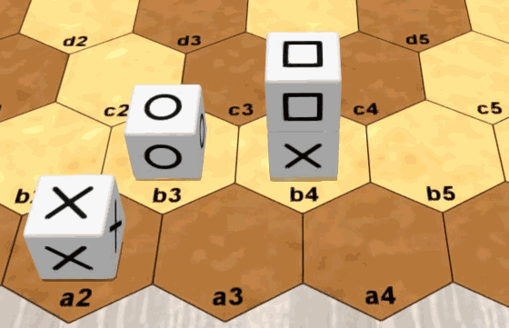
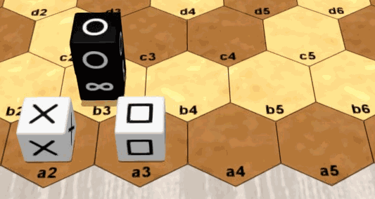
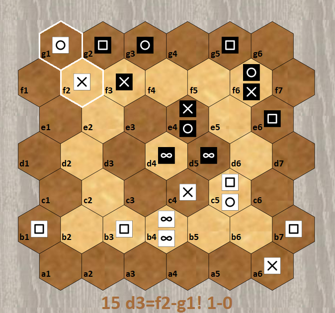
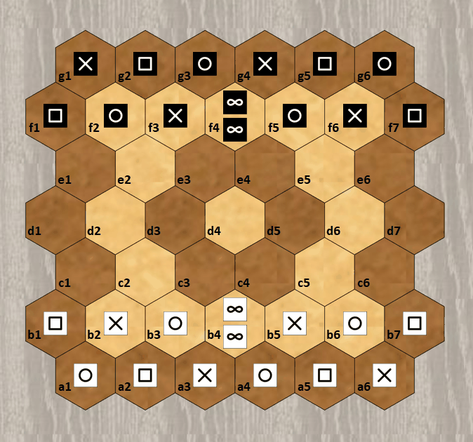

# Pijersi : les règles du jeu


## Informations générales

Nombre de joueurs : 2 / Age minimum : 8 ans / Durée de partie : 15 à 30 minutes 

Type de jeu : traverser pour gagner, empilement et capture ; jeu abstrait

Auteur : Lucas Borboleta, © 2022, CC-BY-NC-SA

Crédit pour les images 3D : [Tabetopia](https://tabletopia.com/games/pijersi)

## Introduction

Dans le jeu "pijersi", deux joueurs, Blanc et Noir, déplacent leurs cubes, seuls ou en piles dynamiques, qui soit s'entre-capturent selon les rôles majeurs de"**pierre**", "**feuille**" et "**ciseaux**", soit sont bloqués par le rôle mineur du "**sage**". Le but est d'atteindre la **ligne arrière adverse**, avec au moins un cube majeur.

## Matériel

Le jeu “pijersi” comprend un plateau de 45 hexagones, 14 cubes blancs et 14 cubes noirs. Voir l'image ci-dessous.

Les six faces de chaque cube sont identiques. Les faces possibles sont “pierre”  , “feuille” , “ciseaux”  et “sage” . Chaque joueur possède 4 pierres, 4 feuilles, 4 ciseaux et 2 sages.


## Mise en place

La mise en place *classique* des cubes est indiquée sur l'image ci-dessus. Les **cubes sages** sont **empilés** au **milieu** de chaque **rangée avant**. Les positions de **Noir** sont **symétriques** de celles de **Blanc** par rapport au **centre** du plateau ; exemple : les cubes ciseaux en a6 et g1.

Afin de varier l'expérience du jeu les mises en place *aléatoire complète* et *aléatoire miroir* peuvent être utilisés ; ils sont expliqués plus loin.

## But du jeu


Vous devez amener le premier, sur la **rangée arrière adverse**,  un cube ou une pile de rôle "pierre", "feuille" ou "ciseaux". Y amener un cube ou une pile de rôle "sage" est autorisé, mais de procure pas la victoire.

Empêcher votre adversaire de jouer vous procure également la victoire.

La partie est nulle après 20 tours (10 par joueur) sans capture, depuis le début ou la dernière capture.

Dans l'image ci-dessus, Blanc gagne en atteignant le but en g6 avec sa "pierre" .

## Vue d'ensemble

Blanc démarre la partie.

A **votre tour**, vous déplacez **un cube** ou **une pile** de votre couleur. La  pile est plus puissance que le cube : elle va plus loin que le cube, et sous conditions, elle permet une **seconde action**.

Se déplacer dans un espace occupé par adversaire vous permet, sous conditions, de capturer son cube ou sa pile. Les pièces capturées sont retirées de façon permanente du plateau.

Vous construisez une pile en déplaçant un cube au-dessus d'un autre. Vous déconstruisez une pile en déplaçant le cube à son sommet. En déplaçant un seul cube, vous pouvez simultanément déconstruire une pile et en construire une autre.

## Rôles et captures

Les six faces d'un cube sont identiques et déterminent son rôle: pierre, feuille, ciseaux ou sage.

Les rôles définissent les possibilités de capture entre pièces (cubes ou piles) : le rôle "pierre" capture le rôle "ciseaux" ; le rôle "ciseaux" capture le rôle "papier" ; le rôle "papier" capture  le rôle "pierre" ; le rôle "sage" ne capture rien et rien ne le capture.

**pierre**  `==>` **ciseaux**  `==>` **feuille**  `==>` **pierre**  

rien`==>` **sage**  `==>` rien

Les captures se font, sans sauter, lors des mouvements qui  sont expliqués plus loin.

## Stacks and captures

A stack is restricted to **two cubes** of the **same color**. Its two cubes have any roles, with **one exception**: no wise above rock, paper or scissors, as showed in the next picture.


The role of a stack is solely determined by the role of the cube at its top. The next picture shows 4 stacks with "paper" role.



The cubes and stacks capture each other, because only their roles matter. When a stack is attacked, both of its cubes are captured. A wise cube at the bottom of a stack of role rock, paper or scissors  can be indirectly captured when attacking its stack. 


In the above  picture: the a3 "scissors" cube can capture the a2 "paper" cube or the b3 "paper" stack or even the a4 "paper" stack; the a4 "paper" stack can capture the b4 "rock" stack or the c5 "rock" cube; the a5 "wise" cube cannot capture any piece, and no piece can capture it.

## Moving a cube

A **cube**, alone or at the top of a stack, **moves** by a **single space**, either to an empty space, or to an occupied space to stack over one of your cubes (respecting the stack rules) or to capture an opposing cube or stack (respecting the capture rules). A cube at the bottom of the stack cannot be moved individually.



In the above  picture: the a2 "scissors" cube can move at a3 or on top of b3; the b4 "paper" can move at b5 or on top of "b3".

## Moving a stack

A **stack moves 1 or 2 aligned spaces**, without forking or jumping over occupied spaces, either towards an empty space or towards an occupied space to capture an opposing cube or stack (respecting the capture rules).


In the above  picture: the b4 "scissors" stack can move to either "a3" or "a4" or "b5" or "b6", but not to "a5".

## Second move

The stack built during your turn can be immediately moved, and conversely, the stack moved during your turn can be immediately deconstructed by moving its top. This sequence of 2 actions is possible only once during your turn.



In the above  picture: in his turn, White can stack the a2 "scissors" cube on a3 and move the a3 stack to a5; in his turn, Black can move the b3 "rock" stack to b5 and move the b5 "rock" cube to a4.

## Random setups

To vary the game experience the *full-random* and *half-random* setups can be used.

Like in *classic* setup, the starting positions are the two first rows of each side, with two cubes being stacked at the middle of the second row. However, for a random setup, the cubes are randomly selected in some agreed order, and if the generated stack is not allowed, then its two cubes are reversed.

In the *full-random* setup, the White and Black sides are prepared independently, as in the next picture.


In the *half-random* setup, the White side is prepared first, then the Black side is deduced by central symmetry, as in the next picture.


## 2D display

The next paired pictures show 2D and 3D equivalent representations you can see about "pijersi". In any 2D picture, **two cubes** inside the **same hexagon** must always be interpreted as a **stack**.

 `<==>`

`<==>`

## Notation

An example of the notation of a match is showed in the next text. Such match is also displayed in the next animated picture. 

```
   g16:sprspr f13:prs f4:ww f57:rsp
   b13:PSR b4:WW b57:SRP a16:RPSRPS

   1 a4-b5=c4             2 f4=d5-d4        
   3 a1-b2=c2             4 f1-f2=d3        
   5 c2=c3-c2             6 d3=c2!-b3!      
   7 a3-b3!               8 c2-b3!          
   9 a2-b3!              10 g6-f7=d6        
  11 a5-b6=c5            12 d6=e6-f6        
  13 c4-c3=d3            14 g4-f5=e4        
  15 d3=f2-g1!
```



Prologue lines describe the setup, which is assumed *classic* when omitted. The cubes are denoted by letters ("p" for "paper", "r" for "rock", ...) with lowercase for Blacks and uppercase for Whites. A stack is always denoted by a single position in top-bottom order. Single cubes are freely denoted by either single position or range of adjacent positions in the same row.

After the prologue, each turn is numbered and described by one or two moves. The source and destination positions are joined by "-" if a cube moves and by "=" if a stack moves. The optional "!" comments a capture.

## Copyright


Copyright (C) 2022 Lucas Borboleta. Pijersi, rules of a strategy game for two players, by Lucas Borboleta (https://github.com/LucasBorboleta/pijersi) is licensed under a Creative Commons Attribution-NonCommercial-ShareAlike 4.0 International License. To view a copy of this license, visit http://creativecommons.org/licenses/by-nc-sa/4.0/.

Permissions beyond the scope of this license may be available at [lucas.borboleta@free.fr](mailto:lucas.borboleta@free.fr).

