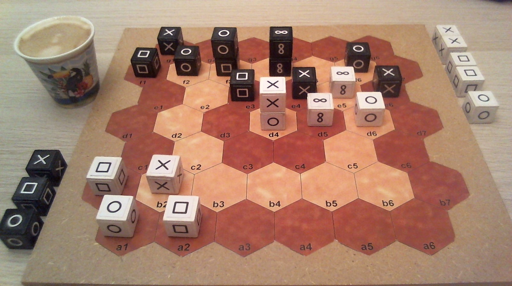
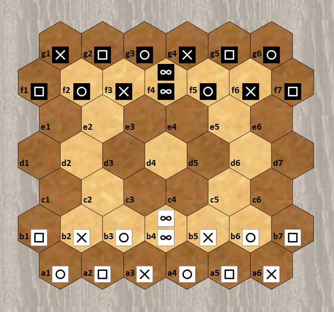

# Pijersi : rules of the game

# General information

Number of players: 2 / Minimum age: 8 years / Game duration: 15 minutes

Game kind: cross win condition, stacking and capturing

Author: Lucas Borboleta, © 2022, CC-BY-NC-SA

# Introduction

In the “pijersi” game, two players, White and Black, start face to face, each with two rows of cubes placed on a board.

In turn, the players move their cubes, make and unmake their stacks, fast but vulnerable.

The goal of each player is to reach the opposing back row first.

Be careful, this race will be prevented by captures or blockages determined by the roles rock, paper, scissors and wise, which are played by cubes and piles.

# Components

The “pijersi” game includes a board of 45 hexagons, 14 white cubes and 14 black cubes. See the figure below.

The six faces of each cube are identical. The possible faces are “circle”, “square”, “cross” and “infinity” which are interpreted as “rock”, “paper”, “scissors” and “wise”. Each player has 4 rocks, 4 papers, 4 scissors and 2 wises.

# Set up

The starting positions of the cubes are shown in the figure above.

The wise cubes are stacked in the middle of each front row. The positions of Black are symmetrical to those of White with respect to the center of the board; example: scissor cubes in a6 and g1.

# Goal of the game

You must bring first, on the opposing back row, a cube or a stack of rock, paper or scissors role.

Bringing there a cube or a stack of wise role is allowed, but it does not provide the victory.

Preventing your opponent from playing also gives you the victory.

The game is a drawn after 20 turns without a capture, since the start or the last capture.

# Overview

White starts the game.

On your turn, you move one of your cubes or one of your stacks. The stack is more powerful than the cube: it goes further than the cube, and under conditions, it allows a second move.

Moving to a space occupied by the opponent allows you to capture his cube or his stack. The captured pieces are permanently removed from the board.

You make a stack by moving a cube to the top of another cube. You undo a stack by moving the cube from its top. By moving a single cube you can simultaneously undo a stack and make another one.

# Roles and captures

The six faces of a cube are identical and determine its role: rock, paper, scissors or wise; respectively according to the symbols “circle”, “square”, “cross” and “infinity”.

The roles define the capture possibilities between pieces (cubes or stacks): the rock role captures the scissors role; the scissors role captures the paper role; the  paper role captures the rock role; the wise role never captures and is never captured.

Captures are made, without jumping, during movements which are explained later.

# Stacks and captures

A stack is restricted to two cubes of the same color. Its two cubes have any role, with one exception: no wise above rock, paper or scissors.

The role of a stack is solely determined by the role of the cube at its top.

The cubes and stacks capture each other, because only their roles matter.

When a stack is attacked, both of its cubes are captured.

A wise cube at the bottom of a stack of role rock, paper or scissors  can be indirectly captured when attacking its stack..

# Moving a cube

A cube, alone or at the top of a stack, moves by a single space, either to an empty space, or to an occupied space to stack over one of your cubes (respecting the stack rules) or to capture an opposing cube or stack (respecting the capture rules).

A cube at the bottom of the stack cannot be moved individually.

# Moving a stack

A stack moves 1 or 2 spaces, without forking or jumping over occupied spaces, either towards an empty space or towards an occupied space to capture an opposing cube or stack (respecting the capture rules).

# Second move

The stack built during your turn can be immediately moved, and conversely, the stack moved during your turn can be immediately deconstructed by moving its top.

This sequence of 2 actions is possible only once during your turn.

# Copyright

Copyright (C) 2022 Lucas Borboleta. Pijersi, rules of a strategy game for two players, by Lucas Borboleta (https://github.com/LucasBorboleta/pijersi) is licensed under a Creative Commons Attribution-NonCommercial-ShareAlike 4.0 International License. To view a copy of this license, visit http://creativecommons.org/licenses/by-nc-sa/4.0/.

Permissions beyond the scope of this license may be available at [lucas.borboleta@free.fr](mailto:lucas.borboleta@free.fr).

