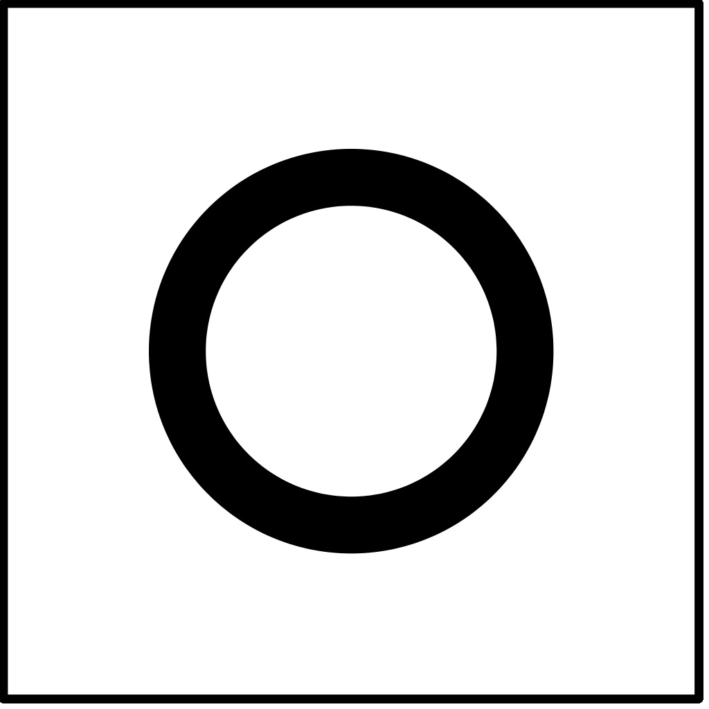
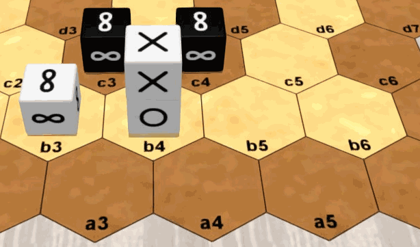

# Pijersi : the rules of the game


## General information

Number of players: 2 / Minimum age: 8 years / Game duration: 15 to 30 minutes

Game kind: cross win condition, stacking and capturing; abstract game

Author: Lucas Borboleta, © 2022, CC-BY-NC-SA

Credit for 3D pictures: [Tabetopia](https://tabletopia.com/games/pijersi)

## Introduction

In the "pijersi" game, two players, White and Black, move their cubes, alone or in dynamic stacks, which either capture each other according to the major roles of "**rock**", "**paper**" and "**scissors**", or are blocked by the minor role of "**wise**". The goal is to reach the **opponent back row**, with at least one major cube.

## Components

The “pijersi” game includes a board of 45 hexagons, 14 white cubes and 14 black cubes. See the picture below.

The six faces of each cube are identical. The possible faces are “rock”  , “paper” , “scissors”  and “wise” . Each player has 4 rocks, 4 papers, 4 scissors and 2 wises.


## Set up

The *classic* starting positions of the cubes are shown in the picture above. The **wise cubes** are **stacked** in the **middle** of each **front row**. The positions of **Black** are **symmetrical** to those of **White** with respect to the **center** of the board; example: scissor cubes in a6 and g1.

To vary the game experience the *full-random* and *half-random* setups can be used; they are explained later.

## Goal of the game


You must bring first, on the **opponent back row**, a cube or a stack of role rock, paper or scissors. Bringing there a cube or a stack of wise role is allowed, but it does not provide the victory.

Preventing your opponent from playing also gives you the victory.

The game is a draw after 20 turns (10 per player) without a capture, since the start or the last capture.

In the above picture, White wins by reaching his goal at g6 with his "rock" .

## Overview

White starts the game.

On **your turn**, you move **one cube** or **one stack** of your color. The stack is more powerful than the cube: it goes further than the cube, and under conditions, it allows a **second move**.

Moving to a space occupied by the opponent allows you, under conditions, to capture his cube or his stack. The captured pieces are permanently removed from the board.

You make a stack by moving a cube to the top of another cube. You undo a stack by moving the cube from its top. By moving a single cube you can simultaneously undo a stack and make another one.

## Roles and captures

The six faces of a cube are identical and determine its role: rock, paper, scissors or wise.

The roles define the capture possibilities between pieces (cubes or stacks): the rock role captures the scissors role; the scissors role captures the paper role; the  paper role captures the rock role; the wise role never captures and is never captured.

**rock**  `==>` **scissors**  `==>` **paper**  `==>` **rock**  

none `==>` **wise**  `==>` none

Captures are made, without jumping, during movements which are explained later.

## Stacks and captures

A stack is restricted to **two cubes** of the **same color**. Its two cubes have any roles, with **one exception**: no wise above rock, paper or scissors, as showed in the next picture.


The role of a stack is solely determined by the role of the cube at its top. The next picture shows 4 stacks with "paper" role.


The cubes and stacks capture each other, because only their roles matter. When a stack is attacked, both of its cubes are captured. A wise cube at the bottom of a stack of role rock, paper or scissors  can be indirectly captured when attacking its stack. 


In the above  picture: the a3 "scissors" cube can capture the a2 "paper" cube or the b3 "paper" stack or even the a4 "paper" stack; the a4 "paper" stack can capture the b4 "rock" stack or the c5 "rock" cube; the a5 "wise" cube cannot capture any piece, and no piece can capture it.

## Moving a cube

A **cube**, alone or at the top of a stack, **moves** by a **single space**, either to an empty space, or to an occupied space to stack over one of your cubes (respecting the stack rules) or to capture an opposing cube or stack (respecting the capture rules). A cube at the bottom of the stack cannot be moved individually.


In the above  picture: the a2 "scissors" cube can move at a3 or on top of b3; the b4 "paper" can move at b5 or on top of "b3".

## Moving a stack

A **stack moves 1 or 2 aligned spaces**, without forking or jumping over occupied spaces, either towards an empty space or towards an occupied space to capture an opposing cube or stack (respecting the capture rules).



In the above  picture: the b4 "scissors" stack can move to either "a3" or "a4" or "b5" or "b6", but not to "a5".

## Second move

The stack built during your turn can be immediately moved, and conversely, the stack moved during your turn can be immediately deconstructed by moving its top. This sequence of 2 actions is possible only once during your turn.


In the above  picture: in his turn, White can stack the a2 "scissors" cube on a3 and move the a3 stack to a5; in his turn, Black can move the b3 "rock" stack to b5 and move the b5 "rock" cube to a4.

## Random setups

To vary the game experience the *full-random* and *half-random* setups can be used.

Like in *classic* setup, the starting positions are the two first rows of each side, with two cubes being stacked at the middle of the second row. However, for a random setup, the cubes are randomly selected in some agreed order, and if the generated stack is not allowed, then its two cubes are reversed.

In the *full-random* setup, the White and Black sides are prepared independently, as in the next picture.


In the *half-random* setup, the White side is prepared first, then the Black side is deduced by central symmetry, as in the next picture.


## 2D display

The next paired pictures show 2D and 3D equivalent representations you can see about "pijersi". In any 2D picture, **two cubes** inside the **same hexagon** must always be interpreted as a **stack**.


## Notation

An example of the notation of a match is showed in the next text. Such match is also displayed in the next animated picture. 

```
   g16:sprspr f13:prs f4:ww f57:rsp
   b13:PSR b4:WW b57:SRP a16:RPSRPS

   1 a4-b5=c4             2 f4=d5-d4        
   3 a1-b2=c2             4 f1-f2=d3        
   5 c2=c3-c2             6 d3=c2!-b3!      
   7 a3-b3!               8 c2-b3!          
   9 a2-b3!              10 g6-f7=d6        
  11 a5-b6=c5            12 d6=e6-f6        
  13 c4-c3=d3            14 g4-f5=e4        
  15 d3=f2-g1!
```


Prologue lines describe the setup, which is assumed *classic* when omitted. The cubes are denoted by letters ("p" for "paper", "r" for "rock", ...) with lowercase for Blacks and uppercase for Whites. A stack is always denoted by a single position in top-bottom order. Single cubes are freely denoted by either single position or range of adjacent positions in the same row.

After the prologue, each turn is numbered and described by one or two moves. The source and destination positions are joined by "-" if a cube moves and by "=" if a stack moves. The optional "!" comments a capture.

## Copyright


Copyright (C) 2022 Lucas Borboleta. Pijersi, rules of a strategy game for two players, by Lucas Borboleta (https://github.com/LucasBorboleta/pijersi) is licensed under a Creative Commons Attribution-NonCommercial-ShareAlike 4.0 International License. To view a copy of this license, visit http://creativecommons.org/licenses/by-nc-sa/4.0/.

Permissions beyond the scope of this license may be available at [lucas.borboleta@free.fr](mailto:lucas.borboleta@free.fr).

